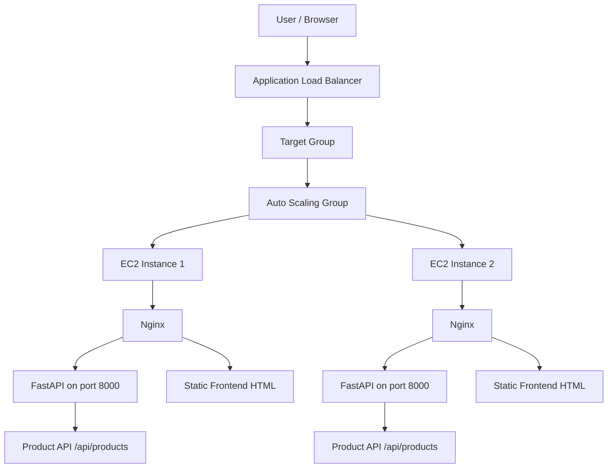
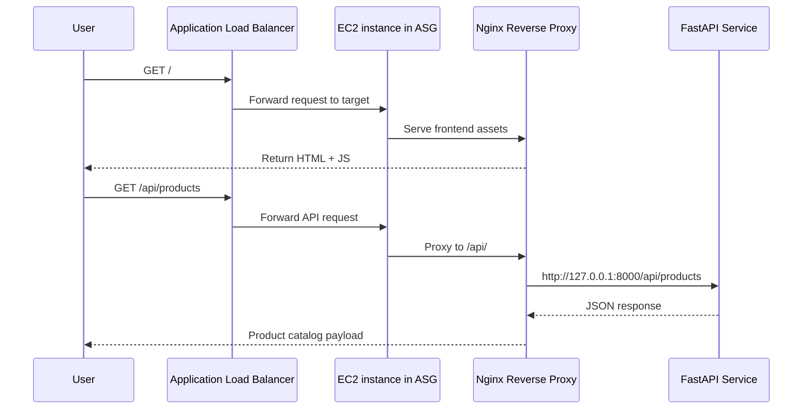

# QuickCart Infra

QuickCart is a cloud-native e-commerce demo deployed on AWS with Terraform. The architecture is designed to be highly available, horizontally scalable, and simple to reason about: the public Application Load Balancer distributes traffic to EC2 instances managed by an Auto Scaling Group, and each instance runs Nginx in front of a FastAPI service that serves the product catalog.

This repository contains the infrastructure definition, app bootstrap scripts, and deployment assets needed to stand up the full stack in AWS.

---

## 1. Architecture Overview

The deployment follows a classic three-tier pattern:

- Internet-facing edge: ALB and public subnets
- Compute layer: EC2 instances in an ASG
- App layer: Nginx + FastAPI backend + static storefront

### High-level architecture



### What each layer does

- VPC: creates the isolated network boundary for the application.
- Public subnets: host internet-facing services, including the ALB and app instances.
- ALB: receives HTTP requests from clients and forwards them to healthy targets.
- Target group: tracks instance health and balances traffic across the ASG nodes.
- ASG: maintains the desired number of instances and automatically replaces unhealthy ones.
- EC2 user data script: installs dependencies, configures Nginx, starts FastAPI, and provisions the frontend.
- Nginx: serves the storefront and proxies API requests to the local FastAPI service.
- FastAPI: exposes the product catalog and health endpoint for the frontend.

---

## 2. Repository Structure

```text
quickcart-infra/
├── README.md
├── terraform.tfstate
├── terraform.tfstate.backup
├── backend/
│   ├── main.py
│   └── requirements.txt
├── frontend/
│   └── index.html
├── infra/
│   ├── alb.tf
│   ├── asg.tf
│   ├── backend.tf
│   ├── main.tf
│   ├── outputs.tf
│   ├── security.tf
│   ├── terraform.tfvars
│   ├── userdata.sh
│   └── variables.tf
└── .github/ (if configured in your project)
```

### Key Terraform files

- infra/main.tf: VPC, IGW, subnets, routing
- infra/alb.tf: ALB, target group, listener
- infra/asg.tf: launch template and scaling rules
- infra/security.tf: security groups and access rules
- infra/userdata.sh: instance bootstrap script
- infra/backend.tf: Terraform backend configuration
- infra/outputs.tf: useful outputs after deployment

---

## 3. Detailed Service Connection Flow

The system is connected in a very specific and intentional way:

### Step 1: Client reaches the ALB
A browser hits the public DNS name or ALB endpoint. The ALB is internet-facing and lives in the VPC public subnets. It is the single entry point for all incoming traffic.

### Step 2: ALB forwards to a target group
The listener on port 80 forwards traffic to an ALB target group. The target group is tied to the ASG instances and checks instance health before sending traffic.

### Step 3: ASG controls instance count
The Auto Scaling Group manages the EC2 fleet. It keeps a minimum of 2 instances and allows scaling up to 4. When CPU rises above the configured threshold, the ASG scales out; when demand drops, the ASG scales in.

### Step 4: EC2 instance boots with user data
Each instance uses a launch template and runs the userdata script when it is started. That script installs:

- Python 3
- pip
- git
- nginx
- FastAPI and uvicorn

Then it creates the backend app and starts a systemd service called fastapi.service.

### Step 5: Nginx sits in front of the app
Nginx is configured as a reverse proxy. It serves the static frontend files from /usr/share/nginx/html and forwards requests like /api/products to the local FastAPI server running on 127.0.0.1:8000.

This means:

- / -> frontend HTML page
- /api/products -> FastAPI product endpoint
- /health -> health check handled by FastAPI

### Step 6: FastAPI returns data
The FastAPI app contains a simple in-memory product list. When the frontend calls /api/products, the data is returned in JSON. The frontend renders the catalog cards using JavaScript.

### Step 7: Health checks keep the stack stable
The ALB target group performs HTTP health checks. If an instance becomes unhealthy, it is removed from rotation and recreated by the ASG.

---

## 4. Request Flow Example



---

## 5. Why This Design Works

This architecture is effective because each layer has a distinct responsibility:

- ALB handles public internet traffic and health-aware routing.
- ASG handles scale and resilience.
- Nginx handles web serving and proxying.
- FastAPI handles API logic and lightweight backend processing.
- Terraform codifies the entire environment so it can be reproduced consistently.

This separation keeps the stack easy to deploy, troubleshoot, and expand.

---

## 6. Security Model

The environment uses security groups to allow only the required traffic:

- ALB security group: allows inbound HTTP from the internet.
- App security group: allows inbound traffic from the ALB, plus SSH if needed for admin access.
- EC2 instances: not directly exposed to the internet except through the ALB.

This architecture reduces attack surface and supports least-privilege networking.

---

## 7. Deployment and Infrastructure Commands

### Terraform

```bash
cd infra
terraform init
terraform validate
terraform plan
terraform apply --auto-approve
```

### Useful AWS checks

```bash
aws elbv2 describe-load-balancers --names quickcart-alb
aws autoscaling describe-auto-scaling-groups --auto-scaling-group-names quickcart-asg
```

### Service checks on EC2

```bash
systemctl status fastapi
systemctl status nginx
curl http://localhost:8000/health
curl http://localhost/api/products
```

---

## 8. Logging and Monitoring

### Application-level logs

The FastAPI service runs under systemd. Logs can be reviewed with:

```bash
journalctl -u fastapi -n 50 --no-pager
```

Nginx logs are typically located in:

```bash
/var/log/nginx/access.log
/var/log/nginx/error.log
```

### Example log view

```text
[INFO] Starting FastAPI application
[INFO] Uvicorn running on http://127.0.0.1:8000
[INFO] Application startup complete
[INFO] GET /api/products 200
[INFO] GET /health 200
```

### Operational monitoring signals

Watch for these indicators:

- ASG instance count changes
- ALB target health checks turning unhealthy
- Nginx 502/503 errors when the FastAPI backend is unavailable
- CPU spikes triggering auto scaling
- failed FastAPI service startup after package or syntax issues

---

## 9. Expected Runtime Behavior

When the stack is running successfully:

1. The ALB is healthy and reachable.
2. The ASG keeps at least two healthy instances.
3. Nginx serves the storefront page.
4. FastAPI returns JSON product data.
5. The UI loads the product catalog without direct backend exposure from the internet.

This creates a robust, scalable demo platform suitable for learning AWS infrastructure, Terraform automation, and reverse-proxy deployment patterns.

---

## 10. Notes for Future Expansion

This project can be extended with:

- private subnets for backend databases
- S3-backed static asset hosting
- CloudWatch alarms and dashboards
- SSL/TLS via ACM + HTTPS listener
- DynamoDB or RDS for persistent product storage
- CI/CD pipeline deployment automation

---

## 11. Summary

QuickCart demonstrates how a production-style web application can be split into clear service boundaries connected through AWS and modern Linux deployment practices. The most important connection chain is:

User -> ALB -> Target Group -> EC2 ASG Instances -> Nginx -> FastAPI -> Product API

This direct flow keeps the system public, scalable, and simple to maintain while still showing the fundamentals of cloud-native architecture.

---

## 12. Useful Git Commands

```bash
git status
git add README.md
git commit -m "docs: add architecture overview and deployment explanation"
git push origin main
```
